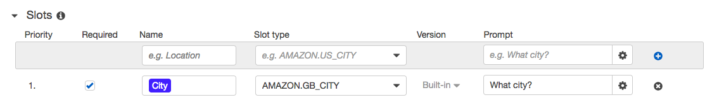

# AWS LEX CHATBOT (WeatherBOT)

User Experience is one of the most important concerns in building modern web applications. No matter how feature-rich is your website, if people don’t find it intuitive to use, you will not reach out to your potential customers.

AWS Lex allows users to easily interact with your website using natural language via a conversational chatbot. Your users can chat in voice or in text and use your product services without having to go through complex user interfaces.

As a developer, you don’t have to be a Machine Learning/Deep Learning expert to have a chatbot embedded into the website. AWS Lex provides advance deep learning functionalities and automatic speech recognition techniques out of the box.

Conversational bot that finds weather information as per user’s requests. Following are the technologies that we will be using in this project.

1. Amazon Lex

2. AWS Lambada

3. AWS IAM

4. AWS CloudWatch

5. OPEN WETHER API


### Architecture


#### Terminology for our bot in AWS Lex. There are 5 main points to remember.

1. Itents

2. Utterances

3. Slots

4. Prompts

5. Fullfillment


Intents are the intentions why someone would use the bot. In our example, someone might want to know the weather of a particular city in the world. We will have an intent called “FindWeather”. We can have more than one intents for the bot. Another intent would be “GreetUser”.

### Creating Intents
Click “Create Intent” button to create the first intent for WeatherBot.Call it “FindWeather” and Add it.


### Utterances
sample utterances a user might ask. They will help our chatbot to learn about user inputs.




In the Slots section, let’s add our City slot. We can define the Prompt message together with that. Our bot can use the intent to get the City slot filled from the user if it didn’t receive it already from the user’s initial utterance.

Our bot requires only one variable to search for the weather. That is the City. Once it is received from the user, the bot will call the action for Fulfillment of the intent.

In our case, let’s call a Lambda function that talks to OpenWeather API to search the weather for the requested City.

### Creating the Lambda Function
Let’s use the Serverless Framework to create our lambda function.
Once we have installed the serverless framework and configure credentials with your AWS account, create a serverless service using below command.

```serverless create --template aws-nodejs --path weather-bot
```
creating lambada function so it can call API and getch wether info from API and pass it to the lex.

We are using openweathermap API in this project.

We have obtained a free API key from https://openweathermap.org/api and added it as a query parameter(APPID) in the URL. We extracted the “City” slot value that was taken by the user and passed it in the URL as well. “units” parameter is set to “metric” in order to get temperature values in Celsius.

### Deploying bot
```
serverless deploy

```

### Testing our bot


### UI for Bot


*Test bot at given link*
[test bot](www.google.com)
